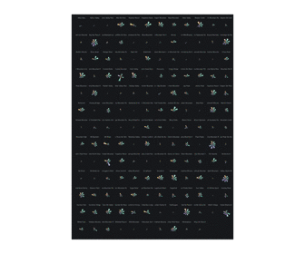

# Fifty snowflakes for fifty of the largest North American ski resorts. How do they compare?

_Nucleating around a dust particle, each snowflake has six branches. Each branch grows independently and its length encodes one of the key figures describing a ski resort: number of trails, average annual snowfall, vertical drop, peak elevation, adult weekend lift ticket, and number of lifts. The number of trails is used to select, and sort, the fifty largest ski resorts._

## Code

Run [main.R](main.R) to reproduce the visualization. The [/poster](./poster) folder contains the viz in PDF, PNG and SVG format.   

## Data

The dataset can be found on the Wikipedia [Comparison of North American ski resorts](https://en.wikipedia.org/wiki/Comparison_of_North_American_ski_resorts) page. 

## Poster

The visualization is 100% ggplot2 and was put together with _cowplot_. You can buy the poster on [Zazzle](https://www.zazzle.com/north_american_ski_resorts_poster-228561527334652568), or print it yourself!  
_License: [CC BY-SA 3.0](https://creativecommons.org/licenses/by-sa/3.0/)_

## Design Process

